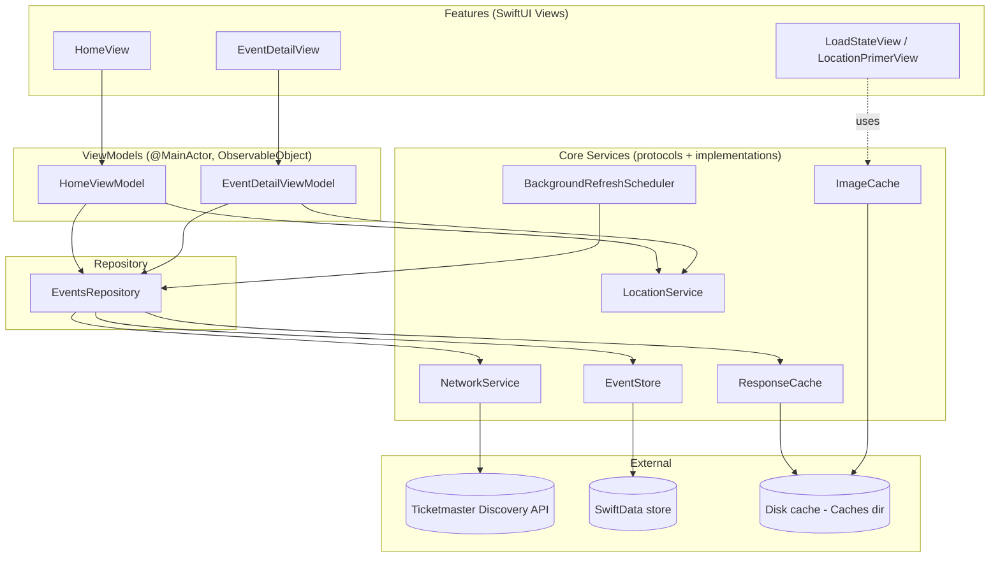
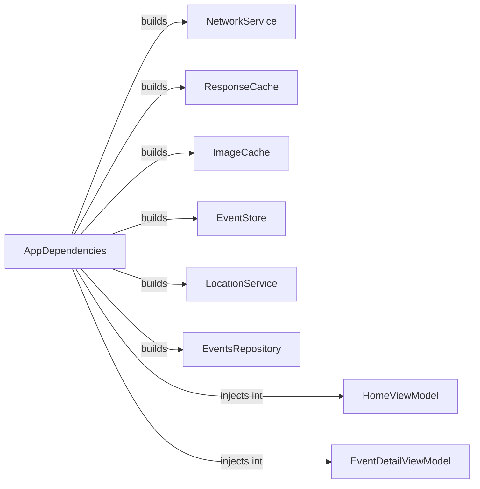

# Architecture

Local Events Explorer is a single-target SwiftUI app built with **MVVM** and
**protocol-oriented dependency injection**. No third-party libraries — every
capability (networking, caching, persistence, location, background refresh)
is implemented on Apple's native frameworks (`URLSession`, `SwiftData`,
`CoreLocation`, `MapKit`, `BackgroundTasks`, `NSCache`, `FileManager`).

## Layered overview

## Composition root

`AppDependencies` (App/AppDependencies.swift) is the **only** place concrete
types are instantiated and wired together. Every ViewModel and service
receives its collaborators as **protocol types** through its initializer —
nothing reaches into a singleton or a global. This is what makes every layer
independently unit-testable: tests build their own `AppDependencies`-shaped
graph out of fakes (`MockNetworkService`, an in-memory `ModelContainer`,
`FakeLocationService`, a fixed `Clock`) with zero production wiring involved.

## Component responsibilities

| Component | Responsibility | Notes |
|---|---|---|
| `NetworkService` / `URLSessionNetworkService` | Issue HTTP requests, decode JSON, classify errors, apply `RetryPolicy` | Single choke point for all network calls — retry/backoff logic is written once |
| `LoadState<Value>` | Uniform state machine (`idle`, `loading(previous:)`, `loaded`, `failed(previous:)`) | Every ViewModel exposes exactly one `LoadState` per screen; `LoadStateView` renders it generically |
| `RetryPolicy` | Exponential backoff + jitter, retryable vs. terminal error classification, max attempts | Pure value type, fully unit-testable with an injected `Clock`/attempt counter, no sleeping in tests |
| `TicketmasterEndpoint` | Builds `URLRequest`s (query params: apikey, geo point, radius, sort, date window, page) | Pure function of input → `URLRequest`, easy to test without network |
| `ResponseCache` | TTL'd cache of raw API responses (memory + disk) | Actor-isolated; avoids refetching the same query window repeatedly |
| `ImageCache` | TTL'd cache of downloaded event images (`NSCache` memory tier + disk tier) | Actor-isolated; memory tier auto-evicts under pressure, disk tier is TTL-checked on read |
| `LocationService` / `CoreLocationService` | Wraps `CLLocationManager`, exposes authorization + one-shot location as `async` | Presents a contextual primer before requesting system permission |
| `EventStore` | All SwiftData reads/writes: upsert-by-id, bookmark toggle, prune, segment queries | Bookmarked events are **structurally excluded** from the prune predicate — never a "don't delete if" afterthought |
| `EventsRepository` | Orchestrates network + `ResponseCache` + `EventStore` with a stale-while-revalidate flow | The only thing ViewModels talk to for event data |
| `BackgroundRefreshScheduler` | Schedules/handles a low-frequency `BGAppRefreshTask` | Refreshes the repository and prunes stale, non-bookmarked data |
| `HomeViewModel` | Owns selected date + selected segment (Explore/Saved) + `LoadState<[Event]>` | Explore reads through the repository (network + `EventStore`), filtered to the selected date; Saved reads `EventStore` directly (fully offline) and ignores the selected date |
| `EventDetailViewModel` | Owns single-event `LoadState`, distance calculation, bookmark toggle | Bookmark toggle is a single call into `EventStore`, reflected everywhere via SwiftData's observation |

## Data flow: Home screen

1. `HomeView` renders a date strip and an Explore/Saved segmented control,
   backed by `HomeViewModel`.
2. **Explore**: `HomeViewModel` asks `EventsRepository.fetchEvents(for:near:)`
   for the selected day's window. It covers the *whole* day — events later
   that day that haven't started yet are included exactly like ones already
   underway or finished; there's no "has it started" filtering at all. The
   repository checks `ResponseCache` (TTL ~10 min); on a hit it emits cached
   data immediately, then **always** revalidates against the network and
   emits again with the outcome (`onUpdate` fires twice on a cache hit, once
   on a miss) — true stale-while-revalidate, not a skip-if-fresh check.
   Successful network responses are upserted into `EventStore` (SwiftData)
   so they're available offline later. `HomeViewModel.prefetchDateStripDays()`
   (fired from its own concurrent `.task` in `HomeView`, not gating the
   initial screen or the location primer) warms every day in the visible
   ±3-day strip on launch, so switching dates in Explore feels instant
   instead of re-triggering a fresh loading state each time.

   Ticketmaster's `startDateTime`/`endDateTime` query params aren't reliably
   honored for every catalog entry (confirmed via live testing: a request
   scoped to 2026-07-15 returned an event actually dated 2024-05-25) — so
   `mapAndFilter`'s client-side window check is what actually guarantees a
   day only ever shows events that truly fall on it, regardless of what the
   server returns.
3. **Saved**: read-only query against `EventStore` for
   `isBookmarked == true`, independent of the date strip — deliberately
   ignores the selected date and works fully offline, no network path at
   all.
4. Tapping a card's heart, or the detail screen's bookmark button, calls
   `EventStore.setBookmarked(_:for:)`. This is the single source of truth;
   both the card and the detail screen observe the same SwiftData-backed
   state.

## Caching strategy & trade-offs

- **Response cache (API JSON)**: short TTL (~10 min) because event
  availability/ordering changes frequently and a stale list is a worse UX
  than one extra network call. Stale-while-revalidate means the user never
  stares at a spinner if *any* cached data exists for that query.
- **Image cache**: long TTL (~7 days) because event artwork essentially
  never changes for a given event id. Two tiers: `NSCache` (fast, evicted
  automatically under memory pressure — "smart resource usage" for free) and
  a disk tier in `Caches/` (survives relaunch, still purgeable by the OS if
  device storage is low, and entries older than the TTL are evicted
  opportunistically on read/prune).
- **SwiftData**: doubles as the "last-fetched events" cache the spec asks
  for *and* the durable store for bookmarks and Explore's offline fallback
  for a day that's already been fetched. Non-bookmarked events older than 30
  days are pruned on launch and during background refresh; bookmarked events
  are **never** pruned, by construction of the prune predicate
  (`EventStoreTests` asserts this directly).
- **Venue-less events are filtered out** of every repository response
  (`DefaultEventsRepository.mapAndFilter`). Ticketmaster's catalog includes
  digital-content/reissue listings with no physical venue — confirmed via a
  direct API call, they all share one generic stock placeholder image and
  have no location to show distance or a maps link for. A *local* events app
  has nothing useful to do with them.

## Native platform features

- **Location**: `CoreLocationService` wraps `CLLocationManager`; the app
  shows a contextual `LocationPrimerView` explaining *why* location is
  requested before the system prompt appears (Apple HIG best practice for
  conversion — priming increases opt-in rates and avoids a cold,
  out-of-context system dialog). If denied, the list still works; distance
  is simply omitted and a Settings deep link is offered.
- **Maps deep link**: `MKMapItem.openInMaps(launchOptions:)` with the venue
  coordinate and name — native, no hand-rolled URL scheme, works whether or
  not the user has Google Maps installed.
- **Background refresh**: `BGAppRefreshTaskRequest` with `earliestBeginDate`
  set ~4h out (low frequency, per the spec), registered via
  `BGTaskSchedulerPermittedIdentifiers` in Info.plist.

## Error handling & concurrency

- All service protocols are `async`/`await`; no completion-handler pyramids.
- `ResponseCache`, `ImageCache`, and `EventStore`'s SwiftData access are
  actor-isolated (or `@ModelActor`) to avoid data races without manual
  locking.
- ViewModels are `@MainActor` `ObservableObject`s; they never touch
  `ModelContext` off the main actor directly — all persistence goes through
  `EventStore`.
- Network failures are classified once (`APIError`) and consistently mapped
  to `LoadState.failed` with the last-known-good value preserved, so the UI
  can say "showing cached results, refresh failed" instead of blanking out.

## API key handling

`Secrets.swift` (gitignored) provides the Ticketmaster API key at compile
time through a `SecretsProviding` protocol; `Secrets.swift.example` is
committed to document the required shape. This keeps the key out of git
history. It does **not** make the key un-exploitable once shipped — any key
embedded in a client binary is extractable via static analysis. The
production-correct fix is a thin server-side proxy that holds the real key
and rate-limits/authenticates the app's own requests; that's called out
explicitly in the README as the next step, out of scope for this
assignment's local-only deliverable.
