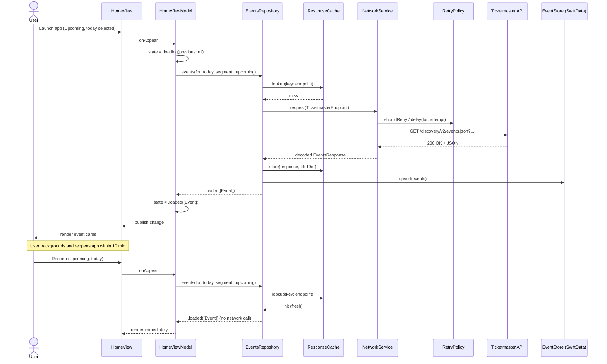
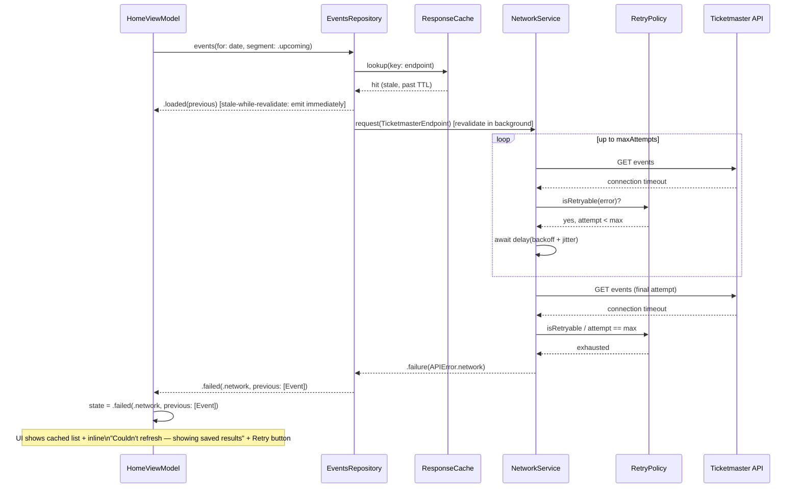
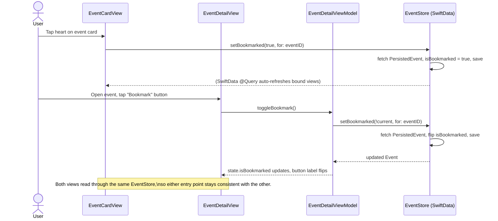
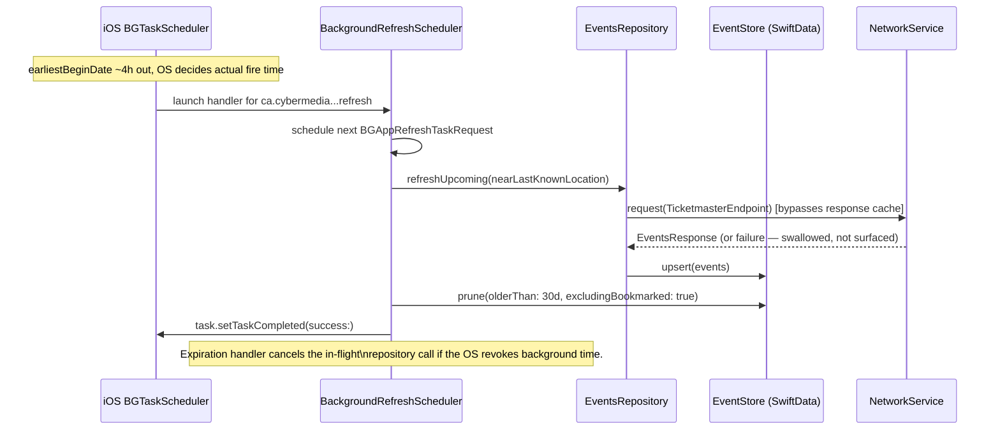

# Sequence Diagrams

## 1. Cold launch → Upcoming events (cache miss, then hit on revisit)

## 2. Network failure with retry, falling back to cached data

## 3. Bookmark toggle (card and detail — single source of truth)

## 4. Background refresh (low frequency)

